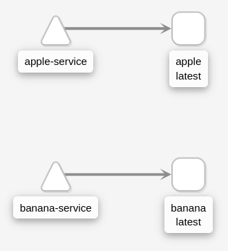
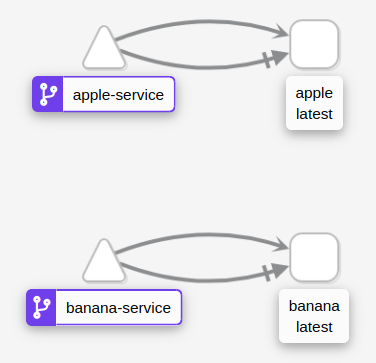

# Run simple service with Istio on minikube cluster

Start a cluster, [install istio](https://istio.io/latest/docs/setup/getting-started/#install), and get ingress HTTP port number:

```bash
minikube start --driver=virtualbox
istioctl install --set profile=demo
kubectl label namespace default istio-injection=enabled
export INGRESS_PORT=$(kubectl -n istio-system get service istio-ingressgateway -o jsonpath='{.spec.ports[?(@.name=="http2")].nodePort}')
```

Deploy simple echo services and make sure they work as NodePort:

```bash
kubectl apply -f service.yaml

export APPLE_PORT=$(kubectl get service apple-service --output jsonpath="{.spec.ports[0].nodePort}")
export BANANA_PORT=$(kubectl get service banana-service --output jsonpath="{.spec.ports[0].nodePort}")

curl http://$(minikube ip):$APPLE_PORT
apple

curl http://$(minikube ip):$BANANA_PORT
banana
```

This is how [Kiali](https://istio.io/latest/docs/setup/getting-started/#dashboard) shows the current state:



## Rout via path

Istio replaces the concept of ingress rules with Gateway and VirtualService, [here](https://blog.jayway.com/2018/10/22/understanding-istio-ingress-gateway-in-kubernetes/) is some overview. Make a gateway, and virtual service, and check how it can be accessed via ingress:

```bash
kubectl apply -f gateway_1.yaml

curl http://$(minikube ip):$INGRESS_PORT/apple
apple

curl http://$(minikube ip):$INGRESS_PORT/banana
banana
```

Check how Kiali shows the current state:



Blue badge shows that service becomes a VirtualService. Not sure why there are two arrows between each service and its pod, the top arrow named HTTP, the bottom one named TCP.

## Route via host

Delete existed gateway:

```bash
kubectl delete -f gateway_1.yaml
gateway.networking.istio.io "fruit-gateway" deleted
virtualservice.networking.istio.io "fruit-service" deleted

curl http://$(minikube ip):$INGRESS_PORT/banana
curl: (7) Failed to connect to 192.168.99.114 port 32446: Connection refused

curl http://$(minikube ip):$INGRESS_PORT/apple
curl: (7) Failed to connect to 192.168.99.114 port 32446: Connection refused
```

Make two different virtual services for different sites/hosts:

```bash
kubectl apply -f gateway_2.yaml

curl -H "Host: apple.fruits.com" http://$(minikube ip):$INGRESS_PORT
apple

curl -H "Host: banana.fruits.com" http://$(minikube ip):$INGRESS_PORT
banana
```

See how service is unavailable because we use wrong host or wrong path:

```bash
# no host
curl -i http://$(minikube ip):$INGRESS_PORT
HTTP/1.1 404 Not Found
date: Thu, 17 Sep 2020 07:56:11 GMT
server: istio-envoy
content-length:

# wrong host
curl -i -H "Host: bananaa.fruits.com" http://$(minikube ip):$INGRESS_PORT/banana
HTTP/1.1 404 Not Found
date: Thu, 17 Sep 2020 07:57:11 GMT
server: istio-envoy
content-length: 0

# correct host, wrong path
curl -i -H "Host: banana.fruits.com" http://$(minikube ip):$INGRESS_PORT/banana
HTTP/1.1 404 Not Found
date: Thu, 17 Sep 2020 07:55:39 GMT
server: istio-envoy
content-length: 0
```
