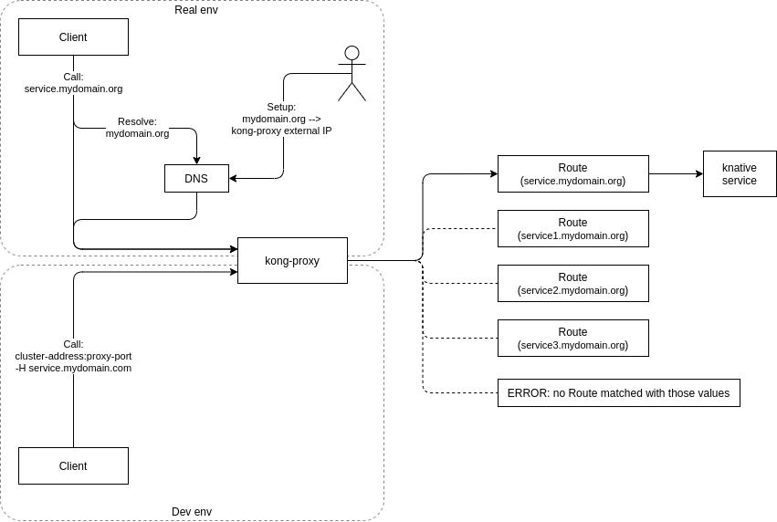

# Run predefined helloworld with autoscale via knative in minikube

Start demo cluster:

```bash
minikube start --driver=virtualbox
```

Install knative and kong as described [here](../README.md).

Install predefined helloworld as knative service:

```bash
echo "
apiVersion: serving.knative.dev/v1
kind: Service
metadata:
  name: helloworld-go
  namespace: default
spec:
  template:
    spec:
      containers:
        - image: gcr.io/knative-samples/helloworld-go
          env:
            - name: TARGET # The environment variable printed out by the sample app
              value: Go Sample v1
" | kubectl apply -f -
```

Here is what we have now:

```bash
kubectl get ksvc
NAME            URL                                        LATESTCREATED         LATESTREADY   READY     REASON
helloworld-go   http://helloworld-go.default.example.com   helloworld-go-xs8j6                 Unknown   RevisionMissing

kubectl get services
NAME                          TYPE           CLUSTER-IP       EXTERNAL-IP                         PORT(S)                             AGE
helloworld-go                 ExternalName   <none>           helloworld-go.default.example.com   <none>                              26s
helloworld-go-xs8j6           ClusterIP      10.100.224.104   <none>                              80/TCP                              2m31s
helloworld-go-xs8j6-private   ClusterIP      10.102.74.151    <none>                              80/TCP,9090/TCP,9091/TCP,8022/TCP   2m31s
kubernetes                    ClusterIP      10.96.0.1        <none>                              443/TCP                             7m12s

```

`ksvc` is a knative object type, it manages `helloworld-go*` services. Use `kubectl delete ksvc helloworld-go` to delete all that stuff above, `delete service` will not work.

See that there are not pods running before we make a request:

```bash
kubectl get pods
No resources found in default namespace.
```

The service is available though proxy:

```bash
curl -v -H "Host: helloworld-go.default.example.com" http://$(minikube ip):32526
...
X-Kong-Upstream-Latency: 1752
...
Hello Go Sample v1!
```

It show a big latency because service pod gets running:

```bash
kubectl get pods
NAME                                              READY   STATUS    RESTARTS   AGE
helloworld-go-xs8j6-deployment-595ddf65f7-r6gfm   2/2     Running   0          55s
```

But it runs much faster in the next time:

```bash
curl -v -H "Host: helloworld-go.default.example.com" http://$(minikube ip):32526
...
< X-Kong-Upstream-Latency: 1
...
Hello Go Sample v1!
```

And after short time knative stops service pods if they are not used:

```bash
kubectl get pods
NAME                                              READY   STATUS    RESTARTS   AGE
helloworld-go-xs8j6-deployment-595ddf65f7-zxslt   2/2     Running   0          107s

kubectl get pods
NAME                                              READY   STATUS        RESTARTS   AGE
helloworld-go-xs8j6-deployment-595ddf65f7-zxslt   2/2     Terminating   0          111s

kubectl get pods
No resources found in default namespace.
```

So it works.

---

There is one proxy and can be many services behind. Proxy use routes to select a service. Header `Host: helloworld-go.default.example.com` helps to choose a desired service. Without it, proxy doesn't know to where it should forward:

```bash
curl -i $(minikube ip):32526
> no Route matched with those values
```

In real life, DNS should be configured to resolve something like "default.example.com" into kong-proxy ip address. But in dev env we don't have DNS and call kong-proxy by ip explicitly, and substitude headers in curl manually.



See also this official diagram of [Kong Ingress Controller Design](https://github.com/Kong/kubernetes-ingress-controller/blob/main/docs/concepts/design.md).