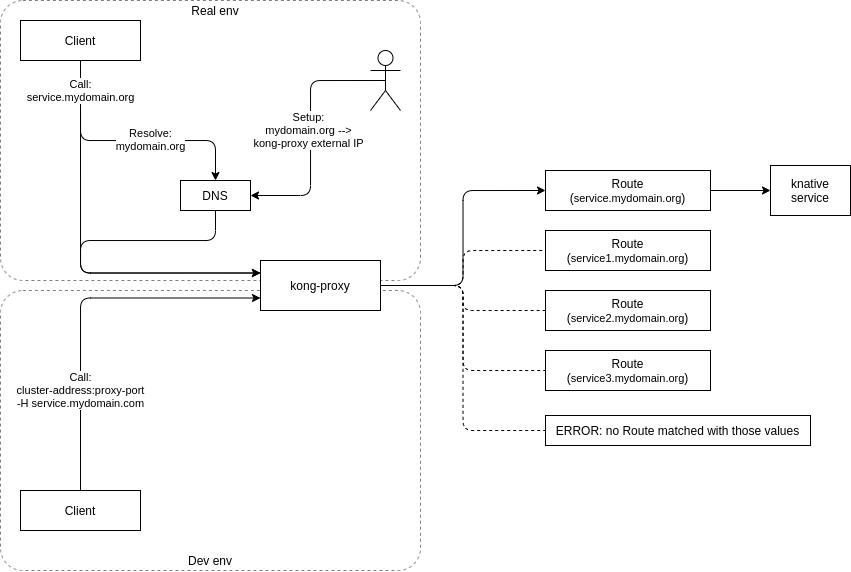

# Prepare knative and kong on minikube

## knative

Install [knative](https://knative.dev/docs/install/any-kubernetes-cluster/) custom resource definitions (CRDs) and serving component:

```bash
kubectl apply --filename https://github.com/knative/serving/releases/download/v0.17.0/serving-crds.yaml
kubectl apply --filename https://github.com/knative/serving/releases/download/v0.17.0/serving-core.yaml
```

See new services:

```bash
kubectl get service -n knative-serving
NAME                TYPE        CLUSTER-IP       EXTERNAL-IP   PORT(S)                           AGE
activator-service   ClusterIP   10.111.170.231   <none>        9090/TCP,8008/TCP,80/TCP,81/TCP   36s
autoscaler          ClusterIP   10.96.107.228    <none>        9090/TCP,8008/TCP,8080/TCP        36s
controller          ClusterIP   10.101.63.37     <none>        9090/TCP,8008/TCP                 36s
webhook             ClusterIP   10.103.137.140   <none>        9090/TCP,8008/TCP,443/TCP         36s
```

## Ingress controller

knative requires something called "network layer", we'll use [kong](https://docs.konghq.com/2.1.x/kong-for-kubernetes/using-kong-for-kubernetes/) for that:

```bash
kubectl apply --filename https://raw.githubusercontent.com/Kong/kubernetes-ingress-controller/0.9.x/deploy/single/all-in-one-dbless.yaml
# or
kubectl apply -f https://bit.ly/k4k8s
```

See new services:

```bash
kubectl get service -n kong
NAME                      TYPE           CLUSTER-IP      EXTERNAL-IP   PORT(S)                      AGE
kong-proxy                LoadBalancer   10.104.32.3     <pending>     80:32131/TCP,443:30891/TCP   42s
kong-validation-webhook   ClusterIP      10.97.241.236   <none>        443/TCP                      42s
```

kong-proxy service shows external ip as "pending" because LoadBalancer service type doesn't work in minikube. But the service is still available at cluster address `$(minikube ip):32131` (for HTTP, the second port is for HTTPs).

Use kong as [ingress](https://kubernetes.io/docs/concepts/services-networking/ingress/) controller for the cluster:

```bash
kubectl patch configmap/config-network \
  --namespace knative-serving \
  --type merge \
  --patch '{"data":{"ingress.class":"kong"}}'
```

See also [Kong official guides on Ingress Controller](https://github.com/Kong/kubernetes-ingress-controller/tree/main/docs/guides) and [Using Kong with Knative](https://github.com/Kong/kubernetes-ingress-controller/blob/main/docs/guides/using-kong-with-knative.md) in particular.

## Proxy overview

There is one kong-proxy but can be many services behind. Proxy uses routes to select a service. Header `Host: your-service-name.default.example.com` helps to choose a desired service. Without it, proxy doesn't know to where it should forward. For example:

```bash
curl -i $(minikube ip):32131
> no Route matched with those values
```

In real life, DNS should be configured to resolve something like `default.example.com` into kong-proxy ip address. But in dev env we don't have DNS and call kong-proxy by ip-address explicitly, and substitude headers in curl manually. For example:

```bash
curl -i -H "Host: your-service-name.default.example.com" $(minikube ip):32131
# some answer from the service
```



See also this official diagram of [Kong Ingress Controller Design](https://github.com/Kong/kubernetes-ingress-controller/blob/main/docs/concepts/design.md).

## Disable tag resolution for local images

knative will not try to pull images if they are in `dev.local` domain. Be sure that [tag resolution](https://knative.dev/docs/serving/tag-resolution/) should be disabled for `dev.local`:

```bash
KUBE_EDITOR="nano" kubectl -n knative-serving edit configmap config-deployment
```

Then copy the `registriesSkippingTagResolving` line from the `_example` section to its parent `data` section. It should look similar to:

```yaml
apiVersion: v1
data:
  # lot of stuff here
  registriesSkippingTagResolving: dev.local,ko.local
kind: ConfigMap
  # other stuff here
```
