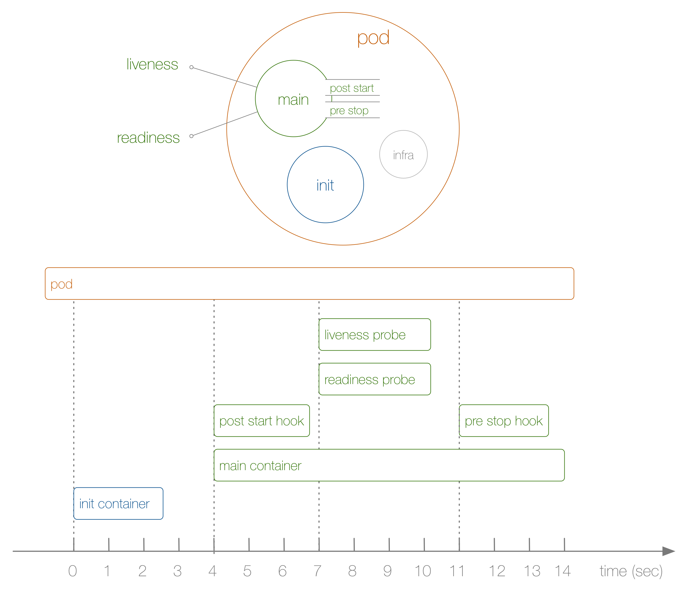

# Example of a pod lifecycle

Start example cluster:

```bash
minikube start --driver=kvm2
```

## Basic example

https://cloud.redhat.com/blog/kubernetes-pods-life

Deploy demo:

```bash
kubectl apply -f deploy.yaml
```

After some time stop the pod via:

```bash
kubectl scale deployment loap --replicas=0
```

See the log:

```bash
minikube ssh
cat /tmp/loap/timing
```

```log
1647329394: INIT
1647329398: MAIN-START
1647329398: STARTED
1647329403: READINESS
1647329408: MAIN-END
1647329412: MAIN-START
1647329413: STARTED
1647329419: LIVENESS
1647329422: MAIN-END
1647329446: MAIN-START
1647329446: STARTED
1647329449: LIVENESS
1647329450: TERMINATING
1647329453: READINESS
1647329456: MAIN-END
```

1) Not shown in the diagram, before anything else, the infra container is launched establishing namespaces the other containers join.
2) The first user-defined container launching is the init container which you can use for pod-wide initialization.
3) Next, the main container and the post-start hook launch at the same time. You define hooks on a per-container basis.
4) Then the liveness and readiness probes kick in, again on a per-container basis.
5) When the pod is killed, the pre-stop hook is executed and finally, the main container is killed, after a grace period. Note that the actual pod termination is a bit more complicated.



## Additional example

Let's see that the main container is not started until pod's init container finishes:

```bash
kubectl apply -f deploy-ex.yaml
```

Wait for pod to be ready:

```bash
kubectl wait --for=condition=ready --timeout=2m pod -l app=loap-ex
```

Stop the pod:

```bash
kubectl scale deployment loap-ex --replicas=0
```

See the log:

```log
1647329918: INIT-START
1647330018: INIT-END
1647330024: MAIN-START
1647330024: STARTED
1647330027: LIVENESS
1647330033: READINESS
1647330034: MAIN-END
1647330041: MAIN-START
1647330041: STARTED
1647330043: READINESS
1647330047: LIVENESS
1647330051: MAIN-END
1647330078: MAIN-START
1647330078: STARTED
1647330083: READINESS
1647330087: LIVENESS
1647330088: MAIN-END
1647330117: MAIN-START
1647330117: STARTED
1647330123: READINESS
1647330127: MAIN-END
1647330181: MAIN-START
1647330181: STARTED
1647330183: READINESS
1647330187: LIVENESS
1647330191: MAIN-END
```

? Where is TERMINATING stage ?
