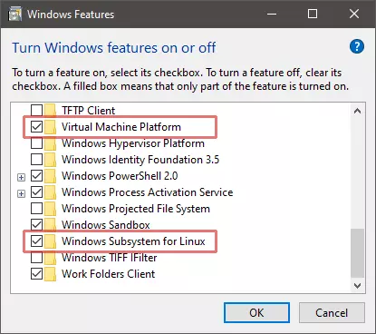
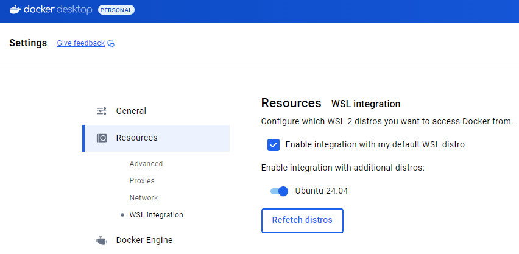

# WSL

Activate WSL2 in system components:



Or via command line:

```bash
dism.exe /online /enable-feature /featurename:Microsoft-Windows-Subsystem-Linux /all /norestart
dism.exe /online /enable-feature /featurename:VirtualMachinePlatform /all /norestart
```

Restart Windows and install a Linux distro:

```bash
wsl --update
wsl --install -d Ubuntu-24.04
```

Then make final preparations in Linux terminal:

```bash
sudo apt update
sudo apt upgrade

# Not sure if this required, but doesn't harm
sudo apt install build-essentials
```

## Docker

Install [Docker Desktop](https://www.docker.com/products/docker-desktop) for Windows. Check the option to integrate it with WSL and then the `docker` command will also be available on WSL instances:

```bash
docker --version
Docker version 27.2.0, build 3ab4256
```

It also installs `kubectl` on both the Windows host and Linux instance.

If docker is already has been installed before installation of a Linux distro, the integration with the new distro should be enabled manually in the DOcker Desktop settings:


