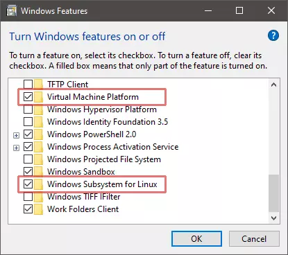
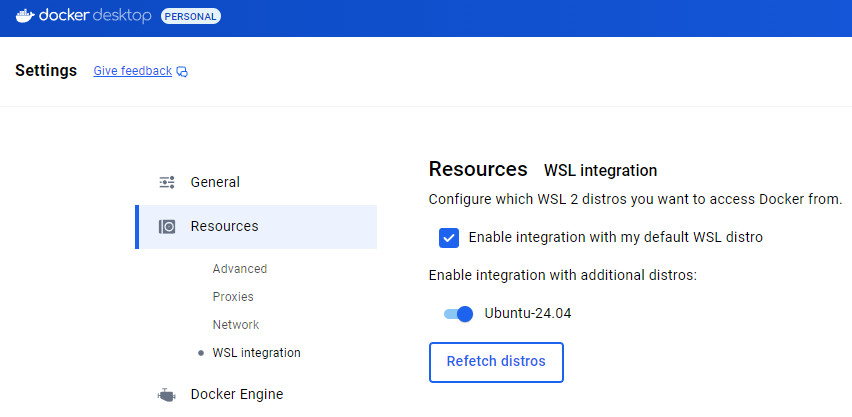

# Start demo cluster with WSL and k3s

## WSL

Activate WSL2 in system components:



Or via command line:

```bash
dism.exe /online /enable-feature /featurename:Microsoft-Windows-Subsystem-Linux /all /norestart
dism.exe /online /enable-feature /featurename:VirtualMachinePlatform /all /norestart
```

Restart Windows and install a Linux distro:

```bash
wsl --update
wsl --install -d Ubuntu-24.04
```

Then make final preparations in Linux terminal:

```bash
sudo apt update
sudo apt upgrade

# Not sure if this required, but doesn't harm
sudo apt install build-essentials
```

## Docker

Install [Docker Desktop](https://www.docker.com/products/docker-desktop) for Windows. Check the option to integrate it with WSL and then the `docker` command will also be available on WSL instances:

```bash
docker --version
Docker version 27.2.0, build 3ab4256
```

It also installs `kubectl` on both the Windows host and Linux instance.

If docker is already has been installed before installation of a Linux distro, the integration with the new distro should be enabled manually in the DOcker Desktop settings:



## Rancher

Check if the Linux instance has the [required settings](https://ranchermanager.docs.rancher.com/v2.5/getting-started/installation-and-upgrade/installation-requirements) set to 1:

```bash
sysctl net.bridge.bridge-nf-call-iptables
net.bridge.bridge-nf-call-iptables = 1
```

If needed, can be changed via:

```bash
sudo sysctl -w <variable name>=<value>
```

Install Rancher [k3s](https://www.rancher.com/products/k3s) on the WSL instance:

```bash
sudo docker run --privileged -d --restart=unless-stopped -p 9080:80 -p 9443:443 rancher/rancher
```

Find a temp admin password of the cluster manager

```bash
docker ps # Find id of the rancher/rancher container
docker logs {container-id} 2>&1 | grep "Bootstrap Password:"
```

```log
2024/10/18 09:21:25 [INFO] Bootstrap Password: z2bdfh8n6lpgf8g6gmhqfmhwzvwbmhl6qpm5zbxj4vxbph2t86nc9k
```

Open a browser, navigate to `localhost:9080`, and login with the temp password. Provide a new password for secure connections.

Go to the Cluster Management page, download cluster's kubeconfig `local.yaml`, put it into `%USERPROFILE%\.kube` on the Windows host (create the dir if it doesn't exists), and rename to `config` (no yaml ext). Now the Windows host can manage the cluster:

```bash
kubectl version
Client Version: v1.30.2
Kustomize Version: v5.0.4-0.20230601165947-6ce0bf390ce3
Server Version: v1.30.2+k3s2

kubectl get nodes -o wide
NAME         STATUS   ROLES                       AGE     VERSION        INTERNAL-IP   EXTERNAL-IP   OS-IMAGE                              KERNEL-VERSION                       CONTAINER-RUNTIME
local-node   Ready    control-plane,etcd,master   2d23h   v1.30.2+k3s2   172.17.0.2    <none>        SUSE Linux Enterprise Server 15 SP6   5.15.153.1-microsoft-standard-WSL2   containerd://1.7.17-k3s1
```
